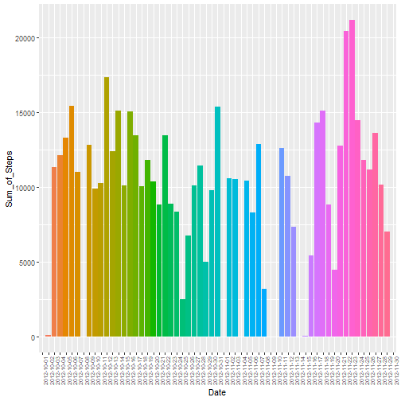
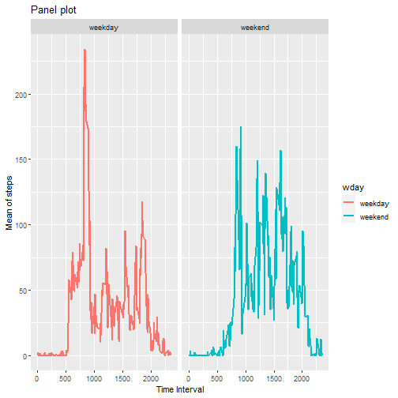

Before we start answering the questions in this project, we need to first read the data set into R. And since the date is character class, we can uss as.Date function from pacakge lubridate to make it "Date" class.


```r
setwd("C:/Users/Waylan/Desktop/Coursera")
data<-read.csv("activity.csv", header=TRUE)
library(lubridate)
data$date<-as.Date(data$date)
```

# 1. What is mean total number of steps taken per day?
Before we answer the question, let's take a look of below figure, it shows how many steps recorded each day.


```r
library(tibble)
library(ggplot2)
temp<-as.data.frame(tapply(data$steps, data$date, sum, na.rm=TRUE))
colnames(temp)<-"Sum_of_Steps"
temp<-rownames_to_column(temp)
colnames(temp)[1]<-"Date"
ggplot(temp, aes(x=Date, y=Sum_of_Steps, fill=Date))+geom_bar(stat="identity")+theme(axis.text.x = element_text(size=7, angle=90), legend.position = "none")
```



In order to plot above figure, we've already use tapply to calculate the total number of steps taken each day. Adn save it in a data frame "temp", let's use below code to calculate the mean and median per day. 


```r
mean(temp$Sum_of_Steps)
```

```
## [1] 9354.23
```

```r
median(temp$Sum_of_Steps)
```

```
## [1] 10395
```

# 2. What is the average daily activity pattern?
In order to create the time-series plot, let's ues function aggregate funtion to create the date we need here, then we can use ggplot to create the plot. And in the last line of below code chunk, we try to find which interval contains the maximum number of steps.


```r
temp1<-aggregate(data$steps, by=list(data$interval), FUN=mean, na.rm=TRUE)
colnames(temp1)<-c("Time_Interval", "Average_Step")

ggplot(temp1, aes(x=Time_Interval, y=Average_Step))+geom_line(col="#05CCEE", size=1.2)+theme_bw()+ggtitle("Time Series Plot")
```


```r
Q2_ans<-temp1$Time_Interval[which.max(temp1$Average_Step)]
time_interval<-paste(Q2_ans, "to", Q2_ans+5)
```

From the result above, we know the time interval contains the maximum number of steps is 835 to 840.

# 3. Imputing missing values
First, let's see how many NAs we have in this dataset

```r
sum(is.na(data$steps))
```

```
## [1] 2304
```

Let's use function impute from package Hmisc. In this project, we'll insert mean of all the steps into those NA value. 


```r
data1<-data
data1$steps<-impute(data$steps, mean)
sum(is.na(data1$steps))
```

```
## [1] 0
```

Now the new data sets "data1" doesn't have any NA value, let's recalcualte the mean and median from Q1. 


```r
temp3<-as.data.frame(tapply(data1$steps, data$date, sum, na.rm=TRUE))
colnames(temp3)<-"Sum_of_Steps"
temp3<-rownames_to_column(temp3)
colnames(temp3)[1]<-"Date"

mean(temp3$Sum_of_Steps)
```

```
## [1] 10766.19
```

```r
median(temp3$Sum_of_Steps)
```

```
## [1] 10766.19
```

So the imputing does change the mean and median, both values are increased a little bit, but it's not significant. 

# 4. Are there differences in activity patterns between weekdays and weekends?

Let's run below code to create a new variable to indicate weekday and weekend by using function wday.


```r
data$wday<-wday(data$date, label = TRUE)
data$wday<-ifelse(data$wday %in% c("Sat", "Sun"), "weekend", "weekday")
```

Let's calculate the average number of steps taken across 5-minute interval by using ddply function from package "plyr", and then we can use ggplot to create the time series plot . 


```r
library(plyr)
p_data<-ddply(data, ~interval+wday, summarise, mean=mean(steps, na.rm=TRUE))

ggplot(p_data, aes(x=interval, y=mean, col=wday))+geom_line(size=1)+facet_grid(.~wday)+xlab("Time Interval")+ylab("Mean of steps")+ggtitle("Panel plot")
```




